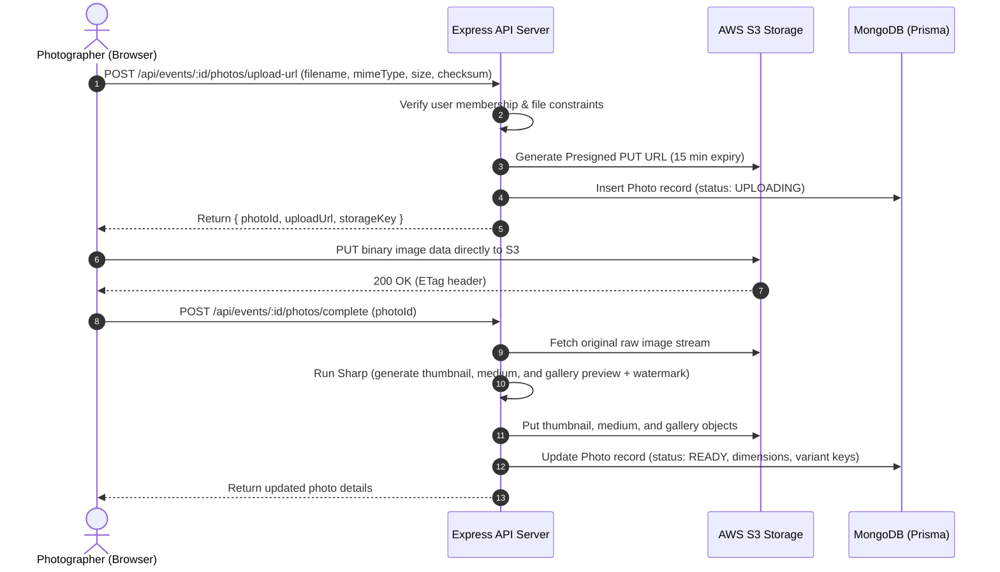
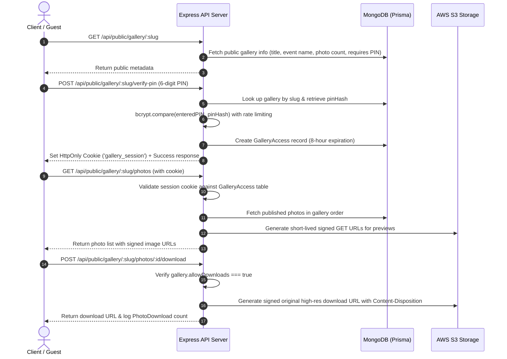
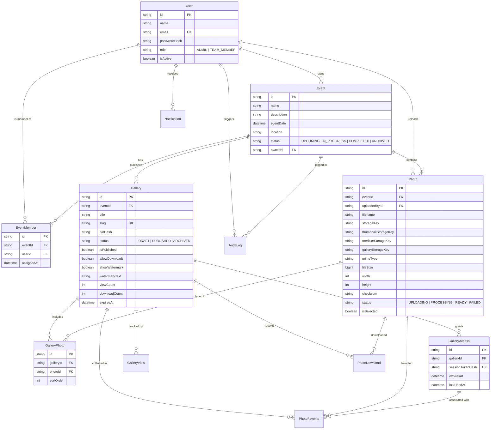

# Framehouse – Event Photo Sharing & Client Gallery Platform

Framehouse is a full-stack platform built for event photography teams and studios. It simplifies the entire photo pipeline: lead photographers can organize events and assign crew members, photographers can upload high-resolution originals directly to cloud storage, the backend automatically generates optimized web variants and custom watermarks, and clients can securely browse, favorite, and download their photos behind a private PIN-protected gallery.

---

## 📑 Table of Contents

- [Project Overview](#-project-overview)
- [Key Features & User Roles](#-key-features--user-roles)
- [Technology Stack](#-technology-stack)
- [System Architecture](#-system-architecture)
  - [High-Level Data Flow](#high-level-data-flow)
  - [Presigned Upload & Processing Sequence](#presigned-upload--processing-sequence)
  - [PIN Verification & Client Session Flow](#pin-verification--client-session-flow)
- [Database Design](#-database-design)
  - [Entity Relationship Diagram](#entity-relationship-diagram)
  - [Core Data Models & Indexing](#core-data-models--indexing)
- [Local Setup Instructions](#-local-setup-instructions)
  - [1. Prerequisites](#1-prerequisites)
  - [2. Clone & Install](#2-clone--install)
  - [3. Configure Environment Variables](#3-configure-environment-variables)
  - [4. Setup Local MongoDB Replica Set](#4-setup-local-mongodb-replica-set)
  - [5. Initialize Database & Seed Sample Data](#5-initialize-database--seed-sample-data)
  - [6. Start Development Servers](#6-start-development-servers)
- [Environment Variables](#-environment-variables)
  - [Backend (`server/.env`)](#backend-serverenv)
  - [Frontend (`client/.env`)](#frontend-clientenv)
- [API Reference](#-api-reference)
- [Default Demo Credentials](#-default-demo-credentials)
- [Production Deployment Guide](#-production-deployment-guide)
  - [1. MongoDB Atlas Setup](#1-mongodb-atlas-setup)
  - [2. AWS S3 Bucket & IAM Configuration](#2-aws-s3-bucket--iam-configuration)
  - [3. Backend Deployment (Render / Railway)](#3-backend-deployment-render--railway)
  - [4. Frontend Deployment (Vercel / Netlify)](#4-frontend-deployment-vercel--netlify)
- [Known Limitations & Roadmap](#-known-limitations--roadmap)
- [License](#-license)

---

## 📸 Project Overview

Managing photography assets for weddings, corporate galas, and live concerts is notoriously messy:
- Passing around external hard drives or clunky Google Drive folders causes version mismatch and slow transfers.
- Sending raw files directly through a web application server consumes excessive CPU, memory, and bandwidth.
- Giving clients access to raw galleries without watermarks or download controls risks unauthorized use.

**Framehouse** tackles these problems by decoupling file delivery from API orchestration:
1. **Direct-to-S3 Uploads**: Photographers upload multi-gigabyte sets of photos straight from the browser to AWS S3 using secure, short-lived presigned URLs. The Node.js API server never has to buffer heavy multi-part payloads.
2. **Automated Variant Pipeline**: Once an original file lands in storage, the server uses Sharp to generate responsive image derivatives (400px thumbnail, 1000px medium, 1600px gallery preview) with optional SVG studio watermarking.
3. **Curated Client Delivery**: Studio admins select the best shots, create a client-ready gallery, configure permissions (e.g. allow high-res downloads, enforce watermarks, set expiry), and generate a 6-digit numeric PIN.
4. **Client Guest Experience**: Clients and event attendees visit a sleek, password-free gallery page, enter the 6-digit PIN, explore pictures in a masonry layout with lightbox preview, favorite their picks, and download singles or full albums.

---

## 👥 Key Features & User Roles

### 1. Studio Admin (`ADMIN`)
- **Event Management**: Create, edit, archive events with dates, locations, and cover banners.
- **Team Delegation**: Assign and revoke event access for team photographers.
- **Photo Curation**: Bulk-select, reorder, tag, or delete incoming photos.
- **Gallery Publishing**: Create customizable client galleries with custom URLs (`/gallery/:slug`), set 6-digit PINs, configure watermark visibility, toggle full-res downloads, and set expiration dates.
- **Analytics & Audit Logs**: Monitor gallery view counts, photo download tallies, client favorites, and workspace audit trails.

### 2. Team Photographer (`TEAM_MEMBER`)
- **Restricted Access**: View only events they have been assigned to by the studio lead.
- **Batch Uploading**: Multi-file drag-and-drop upload queue with real-time progress bars and checksum verification.
- **Status Tracking**: Live updates as photos transition from `UPLOADING` to `PROCESSING` to `READY`.

### 3. Event Client / Guest (Public with PIN)
- **Zero Account Friction**: No signup or password needed; authenticate via a simple 6-digit PIN.
- **Protected Sessions**: Secure, signed, `httpOnly` gallery session cookie valid for 8 hours.
- **Photo Interactions**: Browse optimized masonry view, zoom in via responsive lightbox, toggle favorites, and request signed high-res downloads.

---

## 🛠 Technology Stack

### Frontend Application
- **Core**: React 18 with Vite for fast HMR and optimized production bundles.
- **Routing**: React Router v6.
- **Server State & Caching**: TanStack React Query v5 for optimistic updates, background caching, and automatic refetching.
- **Styling**: Vanilla CSS design system with CSS custom properties (variables), modern typography, glassmorphism overlays, and smooth micro-transitions.
- **Icons**: Lucide React.
- **Testing**: Vitest + React Testing Library.

### Backend API
- **Runtime**: Node.js (native ES Modules).
- **Framework**: Express.js with JSON body parsers, cookie-parser, and CORS.
- **ORM & Data Layer**: Prisma ORM v5 with MongoDB provider.
- **Validation**: Zod schema validators for request parameters, bodies, and query strings.
- **Security**: Helmet headers, bcryptjs password & PIN hashing, constant-time hash comparisons, and express-rate-limit.
- **Testing**: Jest + Supertest.

### Storage & Image Processing
- **Object Storage**: AWS S3 via `@aws-sdk/client-s3` and `@aws-sdk/s3-request-presigner`.
- **Local Fallback**: Built-in in-memory / local mock storage engine when AWS credentials are not configured, enabling 100% offline local development.
- **Image Pipeline**: Sharp (libvips) for high-speed WebP/JPEG transformations, metadata extraction (width, height, EXIF), and dynamic SVG watermark compositing.

---

## 🏛 System Architecture

### High-Level Data Flow

```
+---------------------------------------------------------------------------------------+
|                                    CLIENT BROWSER                                     |
+------------------------------------+------------------------------------+-------------+
                                     |                                    |
          1. REST API / Auth / JSON  |          2. Direct S3 Upload (PUT) |  3. View Images (GET)
                                     v                                    v
+------------------------------------+------------+     +-------------------------------+
|                 EXPRESS BACKEND                 |     |            AWS S3             |
|                                                 |     |        (Object Storage)       |
|  - Role-Based Auth (Admin / Team)               |     |                               |
|  - Rate Limiting & Zod Validation               |     |  - events/:id/originals/*     |
|  - Presigned S3 URL Generator                   |     |  - events/:id/thumbnails/*    |
|  - Upload Completion & Metadata Record          |     |  - events/:id/medium/*        |
|  - Sharp Image Processor (Variants + Watermark) |     |  - events/:id/gallery/*       |
+--------------------+----------------------------+     +---------------+---------------+
                     |                                                  ^
                     | Prisma Transactions                              |
                     v                                                  | Server pushes
+--------------------+----------------------------+                     | processed variants
|                    MONGODB                      |---------------------+
|  (Users, Events, Photos, Galleries, Sessions)   |
+-------------------------------------------------+
```

### Presigned Upload & Processing Sequence



### PIN Verification & Client Session Flow



---

## 🗄 Database Design

The database runs on **MongoDB** accessed through **Prisma ORM**. A MongoDB Replica Set (`rs0`) is required to support multi-document ACID transactions.

### Entity Relationship Diagram



### Core Data Models & Indexing

| Model | Purpose | Key Indexes |
|---|---|---|
| **`User`** | Studio staff and leads. Stores auth credentials and global roles (`ADMIN`, `TEAM_MEMBER`). | `email` (unique) |
| **`Event`** | Photography shoot or wedding project owned by an Admin. | `ownerId`, `eventDate`, `status` |
| **`EventMember`** | Team assignment join table granting photographers access to specific events. | `[eventId, userId]` (unique compound), `eventId`, `userId` |
| **`Photo`** | Lifecycle and storage metadata for uploaded images. | `eventId`, `uploadedById`, `status`, `isSelected`, `[checksum, eventId]` |
| **`Gallery`** | Published client portal with PIN protection and display policies. | `slug` (unique), `eventId`, `isPublished`, `status` |
| **`GalleryPhoto`** | Ordered collection of curated photos belonging to a gallery. | `[galleryId, photoId]` (unique compound), `[galleryId, sortOrder]` |
| **`GalleryAccess`** | Active 8-hour guest sessions authenticated via the 6-digit PIN. | `sessionTokenHash` (unique), `galleryId`, `expiresAt` |
| **`PhotoFavorite`** | Guest favorite selections tracked per gallery session. | `[galleryId, photoId, sessionId]` (unique compound) |
| **`GalleryView`** | Visitor analytics log tracking gallery traffic. | `galleryId`, `viewedAt` |
| **`PhotoDownload`** | Audit trail for full-resolution photo downloads. | `galleryId`, `photoId`, `downloadedAt` |
| **`AuditLog`** | Operational security log of all admin actions and assignments. | `userId`, `eventId`, `action`, `createdAt` |
| **`Notification`** | In-app alerts for studio members (new assignments, uploads completed). | `userId`, `isRead`, `createdAt` |

---

## 🚀 Local Setup Guide

### 1. Prerequisites
- **Node.js**: v18.0.0 or higher (v20+ recommended).
- **npm**: v9.0.0 or higher.
- **MongoDB**: v6.0+ running as a **replica set** (required for Prisma transactions).

---

### 2. Clone & Install

```bash
# Clone repository
git clone https://github.com/Divakar2547/Framehouse-.git
cd Framehouse-

# Install backend dependencies
cd server
npm install

# Install frontend dependencies
cd ../client
npm install
```

---

### 3. Configure Environment Variables

Create `.env` inside the `server/` directory:

```bash
# server/.env

NODE_ENV=development
PORT=5000
CLIENT_URL=http://localhost:5173
SERVER_URL=http://localhost:5000

# MongoDB Replica Set connection URL
DATABASE_URL="mongodb://127.0.0.1:27017/event_photo_gallery?replicaSet=rs0&directConnection=true"

# Secrets (use strong random strings in production)
JWT_SECRET=dev-jwt-secret-key-at-least-32-chars-long
JWT_EXPIRES_IN=7d
GALLERY_SESSION_SECRET=dev-gallery-session-secret-key-32-chars

# AWS S3 Storage (Leave blank to use the built-in Local Mock Storage)
AWS_REGION=us-east-1
AWS_ACCESS_KEY_ID=
AWS_SECRET_ACCESS_KEY=
AWS_S3_BUCKET=

# Upload & Rate Limits
MAX_FILE_SIZE=52428800
RATE_LIMIT_WINDOW_MS=900000
RATE_LIMIT_MAX=100
PIN_RATE_LIMIT_MAX=5
```

Create `.env` inside the `client/` directory (optional for local dev since Vite defaults to localhost):

```bash
# client/.env
VITE_SERVER_URL=http://localhost:5000
```

> **Local Mock Storage Note**: If `AWS_ACCESS_KEY_ID` is left empty, the server automatically boots an in-memory/local mock storage engine. You do NOT need an active AWS account to run, test, and develop Framehouse locally.

---

### 4. Setup Local MongoDB Replica Set

Prisma requires MongoDB to run as a replica set even locally. You can set this up either using Docker or with your native MongoDB installation:

#### Option A: Using Docker (Fastest)

```bash
docker run -d --name mongo-replica \
  -p 27017:27017 \
  mongo:7.0 --replSet rs0

# Initialize replica set
docker exec -it mongo-replica mongosh --eval "rs.initiate({_id:'rs0',members:[{_id:0,host:'localhost:27017'}]})"
```

#### Option B: Using Native Local MongoDB

If running MongoDB locally via command line:
```bash
# Start mongod with replica set flag
mongod --dbpath /path/to/data --replSet rs0 --port 27017

# In a separate terminal, initiate the replica set
mongosh --eval "rs.initiate()"
```

---

### 5. Initialize Database & Seed Sample Data

```bash
cd server

# Generate Prisma Client code
npx prisma generate

# Push schema directly to MongoDB
npx prisma db push

# Seed demo users, events, photos, and sample client gallery
npm run db:seed
```

---

### 6. Start Development Servers

Open two terminal windows:

```bash
# Terminal 1: Backend Server (runs on http://localhost:5000)
cd server
npm run dev
```

```bash
# Terminal 2: Frontend Client (runs on http://localhost:5173)
cd client
npm run dev
```

Open your browser and navigate to `http://localhost:5173`.

---

## 🔐 Environment Variables

### Backend (`server/.env`)

| Variable | Required | Default | Description |
|---|---|---|---|
| `NODE_ENV` | Yes | `development` | Runtime environment (`development`, `production`, `test`). |
| `PORT` | No | `5000` | Port for Express server to listen on. |
| `CLIENT_URL` | Yes | `http://localhost:5173` | Allowed origin for CORS headers and cookie sharing. |
| `SERVER_URL` | Yes | `http://localhost:5000` | Base URL of the backend API server. |
| `DATABASE_URL` | Yes | — | MongoDB connection string (must include `replicaSet` query parameter). |
| `JWT_SECRET` | Yes | — | 32+ character secret for signing user authentication JWTs. |
| `JWT_EXPIRES_IN` | No | `7d` | Expiration lifespan of JWT tokens (`1d`, `7d`, `30d`). |
| `GALLERY_SESSION_SECRET` | Yes | — | Secret key used to sign guest gallery access tokens. |
| `AWS_REGION` | No | `us-east-1` | AWS region where the S3 bucket is hosted. |
| `AWS_ACCESS_KEY_ID` | No | `""` | AWS IAM Access Key. If omitted, server falls back to mock storage. |
| `AWS_SECRET_ACCESS_KEY` | No | `""` | AWS IAM Secret Access Key. |
| `AWS_S3_BUCKET` | No | `""` | Name of the private S3 bucket. |
| `MAX_FILE_SIZE` | No | `52428800` | Maximum upload file size in bytes (default: 50MB). |
| `RATE_LIMIT_WINDOW_MS` | No | `900000` | Rate limiter window in milliseconds (default: 15 mins). |
| `RATE_LIMIT_MAX` | No | `100` | Max API requests per IP in the window. |
| `PIN_RATE_LIMIT_MAX` | No | `5` | Max PIN verification attempts per IP in the window. |

### Frontend (`client/.env`)

| Variable | Required | Default | Description |
|---|---|---|---|
| `VITE_SERVER_URL` | Yes (in prod) | `""` (proxied in dev) | Base URL pointing to the deployed backend API (e.g., `https://api.yourdomain.com`). |

---

## 📡 API Reference

### Authentication
- `POST /api/auth/login` — Sign in with email and password. Sets `httpOnly` JWT cookie.
- `POST /api/auth/register` — Register a new studio admin account.
- `POST /api/auth/logout` — Clear auth cookie.
- `GET /api/auth/me` — Return authenticated user's profile and permissions.

### Events & Team Management
- `GET /api/events` — List all accessible events (Admins see all; Team members see assigned only).
- `POST /api/events` — Create a new event shoot *(Admin only)*.
- `GET /api/events/:id` — Get single event details with upload statistics.
- `PUT /api/events/:id` — Update event details *(Admin only)*.
- `DELETE /api/events/:id` — Delete event and related photos *(Admin only)*.
- `GET /api/events/team-members` — Search all studio photographers for assignment.
- `GET /api/events/:id/members` — List photographers assigned to an event.
- `POST /api/events/:id/members` — Assign a photographer to an event *(Admin only)*.
- `DELETE /api/events/:id/members/:userId` — Remove photographer assignment *(Admin only)*.

### Photo Ingestion & Processing
- `GET /api/events/:id/photos` — Fetch photos for an event with short-lived presigned thumbnail URLs.
- `POST /api/events/:id/photos/upload-url` — Request presigned S3 PUT URL for direct upload.
- `POST /api/events/:id/photos/complete` — Notify server of upload completion; triggers Sharp processing.
- `POST /api/events/:id/photos/bulk-select` — Bulk select / deselect photos for gallery inclusion.
- `DELETE /api/photos/:id` — Soft-delete photo and remove variants from storage.

### Galleries & Publishing
- `POST /api/events/:id/galleries` — Create a new draft gallery with a 6-digit PIN *(Admin only)*.
- `POST /api/galleries/:id/photos` — Add selected photos to a gallery *(Admin only)*.
- `POST /api/galleries/:id/publish` — Publish gallery to make it accessible to clients *(Admin only)*.
- `POST /api/galleries/:id/pin` — Rotate gallery PIN and revoke existing sessions *(Admin only)*.
- `GET /api/galleries/:id/analytics` — View visitor metrics, total views, and download counts.

### Public Client Portal (Guest Access)
- `GET /api/public/gallery/:slug` — Retrieve public gallery metadata (title, date, cover, PIN status).
- `POST /api/public/gallery/:slug/verify-pin` — Verify 6-digit PIN and receive signed session cookie.
- `GET /api/public/gallery/:slug/photos` — Retrieve list of photos with signed preview URLs *(Session required)*.
- `POST /api/public/gallery/:slug/photos/:photoId/download` — Obtain presigned high-res download URL.
- `POST /api/public/gallery/:slug/photos/:photoId/favorite` — Toggle photo favorite status.
- `GET /api/public/gallery/:slug/favorites` — List all favorited photos for the current session.

---

## 🔑 Default Demo Credentials

When you run `npm run db:seed` in the `server` directory, the following test accounts and gallery are created:

| Role | Email | Password | Access Scope |
|---|---|---|---|
| **Studio Admin** | `admin@example.com` | `Admin@123456` | Full workspace control, event creation, team assignments, publishing. |
| **Team Photographer 1** | `photographer@example.com` | `Member@123456` | Upload and view access for assigned events. |
| **Team Photographer 2** | `rahul@example.com` | `Member@123456` | Upload and view access for assigned events. |

### Sample Demo Client Gallery
- **Public URL**: `http://localhost:5173/gallery/arjun-priya-wedding-2026`
- **Access PIN**: `482917`

---

## 🚢 Production Deployment Guide

A recommended production architecture uses **MongoDB Atlas** for the database, **AWS S3** for media storage, **Render** or **Railway** for the Node API, and **Vercel** or **Netlify** for the Vite React frontend.

### 1. MongoDB Atlas Setup

1. Create a cluster on [MongoDB Atlas](https://www.mongodb.com/cloud/atlas) (M0 Free or dedicated). Atlas automatically configures replica sets required by Prisma.
2. In **Database Access**, create a user (e.g. `framehouse_user`) with `readWriteAnyDatabase` privileges.
3. In **Network Access**, add `0.0.0.0/0` (or the static outgoing IP of your backend host).
4. Copy the connection string:
   ```
   mongodb+srv://<username>:<password>@cluster0.xxxxx.mongodb.net/event_photo_gallery?retryWrites=true&w=majority
   ```

---

### 2. AWS S3 Bucket & IAM Configuration

1. **Create S3 Bucket**:
   - Bucket name: e.g. `framehouse-media-production`
   - Region: `us-east-1` (or your preferred region)
   - **Keep "Block all public access" ENABLED**. All photo access is controlled through presigned URLs.

2. **Configure CORS on S3 Bucket**:
   In S3 Console > Bucket > **Permissions** > **Cross-origin resource sharing (CORS)**, paste:
   ```json
   [
     {
       "AllowedHeaders": ["*"],
       "AllowedMethods": ["GET", "PUT", "POST", "HEAD"],
       "AllowedOrigins": ["https://your-frontend.vercel.app", "https://yourdomain.com"],
       "ExposeHeaders": ["ETag"]
     }
   ]
   ```

3. **Create IAM User & Security Policy**:
   In AWS IAM, create a user `framehouse-app-user` with programmatic access and attach this inline policy:
   ```json
   {
     "Version": "2012-10-17",
     "Statement": [
       {
         "Effect": "Allow",
         "Action": [
           "s3:PutObject",
           "s3:GetObject",
           "s3:DeleteObject",
           "s3:HeadObject"
         ],
         "Resource": "arn:aws:s3:::framehouse-media-production/*"
       }
     ]
   }
   ```
   Generate and save the **Access Key ID** and **Secret Access Key**.

---

### 3. Backend Deployment (Render / Railway)

1. Connect your repository to Render or Railway as a **Web Service**.
2. Set configuration parameters:
   - **Root Directory**: `server`
   - **Environment**: `Node`
   - **Build Command**: `npm install && npx prisma generate`
   - **Start Command**: `npm start`
3. Add Environment Variables:
   - `NODE_ENV`: `production`
   - `CLIENT_URL`: `https://your-frontend.vercel.app`
   - `SERVER_URL`: `https://your-backend.onrender.com`
   - `DATABASE_URL`: `mongodb+srv://...`
   - `JWT_SECRET`: *(Generate a secure 64-char string)*
   - `GALLERY_SESSION_SECRET`: *(Generate a secure 64-char string)*
   - `AWS_REGION`: `us-east-1`
   - `AWS_ACCESS_KEY_ID`: `AKIA...`
   - `AWS_SECRET_ACCESS_KEY`: `...`
   - `AWS_S3_BUCKET`: `framehouse-media-production`
4. Deploy the service and verify `GET /health` returns `200 OK`.

---

### 4. Frontend Deployment (Vercel / Netlify)

1. Connect the repository to Vercel.
2. Set build settings:
   - **Root Directory**: `client`
   - **Framework Preset**: `Vite`
   - **Build Command**: `npm run build`
   - **Output Directory**: `dist`
3. Set Environment Variable:
   - `VITE_SERVER_URL`: `https://your-backend.onrender.com`
4. Deploy. Verify that cookies are properly set during login and PIN verification (requires HTTPS in production for `secure: true` cookies).

---

## ⚠️ Known Limitations & Roadmap

Like any real-world production engineering system, there are architectural trade-offs in the current version:

### Known Limitations
1. **Synchronous Image Processing on API Thread**: When a photo upload completes, the Express server processes thumbnail/medium/gallery variants in-process using Sharp. For batches of 200+ photos uploaded at once, this can spike CPU on small container instances (e.g. Render free tier).
2. **Batch Downloads Memory Bound**: Downloading all high-resolution photos creates an on-the-fly zip archive stream. If an event has 50GB of raw images, downloading the entire batch in a single request can stress server memory.
3. **No Direct Video Transcoding**: The current pipeline handles raster and raw photograph formats (`image/jpeg`, `image/png`, `image/webp`). Video footage (`.mp4`, `.mov`) is not processed into streaming segments (HLS/DASH).
4. **Single-Region S3 Storage**: Signed URLs point directly to the origin S3 bucket. Without an Amazon CloudFront CDN distribution in front of S3, global clients further from the bucket region may experience higher latency when loading thumbnails.

### Future Roadmap
- [ ] **Background Processing Queue**: Offload Sharp variant generation to BullMQ workers powered by Redis or AWS Lambda S3 triggers.
- [ ] **CloudFront CDN Integration**: Distribute public and signed image requests through Amazon CloudFront edge locations.
- [ ] **Client Face Recognition**: AI-assisted face tagging to allow guests to find all photos containing their face automatically.
- [ ] **Asynchronous ZIP Generation**: Offload full gallery album ZIP builds to an S3-to-S3 background job with presigned download links emailed upon completion.
- [ ] **Watermark Customizer**: Interactive in-browser canvas tool for studio leads to upload transparent PNG logos and position watermarks.

---

## 📄 License

This project is licensed under the [MIT License](LICENSE).